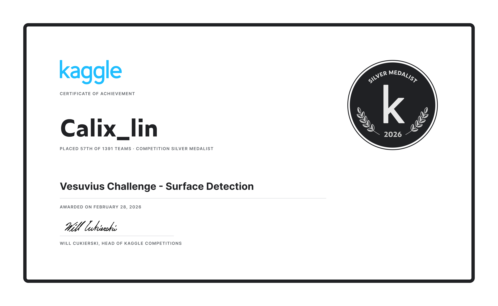

# 👋 Hi, I'm Calix Lin

  
  

## 🏆 Kaggle Silver Medal

  

## 🎯 About Me

- 🔭 Working on **AI/ML** (Large Language Models)
- 🌱 Learning: **DeepSpeed, vLLM, SGLang, PyTorch**
- 👨‍💻 Junior at **Hubei University** - Electronic Information Engineering
- 📫 Contact: **1553181496@qq.com**

## 🏢 Internship Experience

| Company | Role | Direction |
|---------|------|-----------|
| **Zhipu AI (智谱华章)** | LLM Algorithm Intern | Full-parameter SFT Fine-tuning |
| **China Telecom Hubei** | AI Algorithm Intern | Computer Vision + Speech |

## 🏆 Achievements

- 🥈 Silver Medal - Vesuvius Challenge (Kaggle) - #57/1391
- 📄 ClinKD Medical VQA Paper (Submitted to NIPS)
- 🏆 Smart Campus Digital Twin System (Team Lead)
- 🏥 GI Capsule Endoscopy Recognition (96.3% Accuracy)

## 🛠 Tech Stack

### AI/ML

### Languages

### Tools

## 📊 GitHub Stats

  
  

## 🔗 Connect

  
  

---
⭐️ From [Calix](https://github.com/Calix-L)
