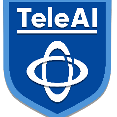

  

 

  
  
  
  

---

Focused on building production-ready post-training pipelines — from data curation and SFT to RLHF and alignment — with hands-on experience across three AI organizations.

---

### Experience

<table>
  <tr>
    <td width="72" valign="top">
      
    </td>
    <td valign="top">
      <strong>AI Research Intern</strong> &middot; <a href="https://github.com/Kingsoft-LLM">Kingsoft</a> 
      2026.03 — Present 
      <em>SFT &middot; RLHF &middot; Alignment</em> 
      Iterating post-training pipelines for production LLMs — data quality control, preference-pair construction, and alignment behavior optimization.
    </td>
  </tr>
</table>

<table>
  <tr>
    <td width="72" valign="top">
      
    </td>
    <td valign="top">
      <strong>AI Research Intern</strong> &middot; <a href="https://www.zhipuai.cn">Zhipu AI</a> 
      2025.09 — 2026.02 
      <em>SFT &middot; RL &middot; Evaluation</em> 
      Built SFT + RL pipelines covering instruction formatting, training recipe tuning, and post-training evaluation with inference-oriented validation.
    </td>
  </tr>
</table>

<table>
  <tr>
    <td width="72" valign="top">
      
    </td>
    <td valign="top">
      <strong>AI Research Intern (Multimodal)</strong> &middot; <a href="https://github.com/Tele-AI">China Telecom AI Research Institute</a> 
      2025.06 — 2025.09 
      <em>Multimodal &middot; Fine-tuning &middot; Evaluation</em> 
      Multimodal R&D across dataset preparation, fine-tuning, and evaluation for text-image understanding; bridged research prototypes with serving pipelines.
    </td>
  </tr>
</table>

---

### Post-Training Tech Stack

  
  
  
  
  
  
  
  
  
  
  

---

### Engineering Snapshot

  
  
  
  

  

  
  

---

### Contact

  
  

